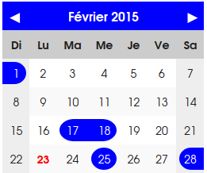
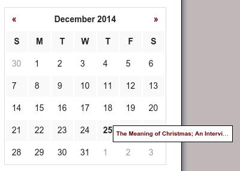

.. ==================================================
.. FOR YOUR INFORMATION
.. --------------------------------------------------
.. -*- coding: utf-8 -*- with BOM.

.. include:: ../Includes.txt

.. _introduction:

Introduction
============

.. _what-it-does:

What does it do?
----------------

This TYPO3 extension provides a *calendar* view to news_, as an alternative to *List* or *Date Menu* views.
It allows to quickly access news related to the current month. Default provided template displays
a small calendar for the month, with the list of news for each day as a popup. However, one could
easily customize the template to display the calendar as he wishes. 

Optionally, the extension can work with roq_newsevent_ extension, and display events that
span multiple days.

.. _news: http://typo3.org/extensions/repository/view/news

.. _screenshots:

Screenshots
-----------

   Default calendar view.

   This shows the included default template and stylesheet for the calendar. Multi-day events are
   possible using roq_newsevent_ extension. In this example, the calendar is localized in French.

   An real-life example of calendar view.

   This a a screenshot of the cb_newscal extension used on a real website (http://op-dma.com/).
   Stylesheet was personalized to fit appearence of the website.
   The opened popup shows the link to a news related to November 30, 2014.

.. _roq_newsevent: http://typo3.org/extensions/repository/view/roq_newsevent

Upgrading
---------

.. important::
    
    Be aware that templates from cb_newscal 1.x are not compatible with cb_newscal 1.2. If you used
    custom templates in a previous version of cb_newscal, you will need to upgrade them.
    Use the provided default template as a basis for customization.