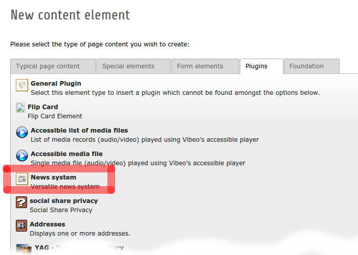
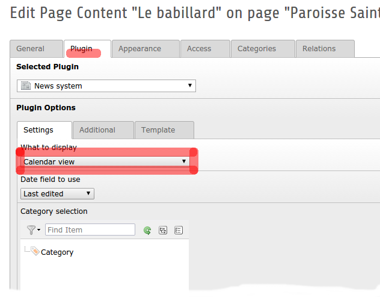
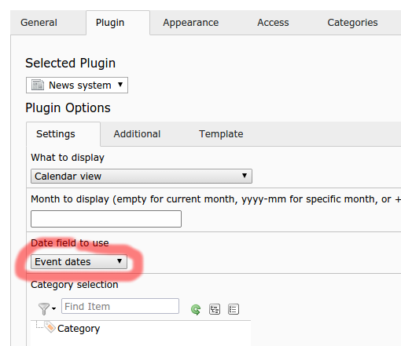

.. ==================================================
.. FOR YOUR INFORMATION
.. --------------------------------------------------
.. -*- coding: utf-8 -*- with BOM.

.. include:: ../Includes.txt

.. _user-manual:

Users Manual
============

Inserting Calendar plugin
-------------------------

To insert a calendar in a page, insert a *News system* plugin.

   Choose *News system* plugin.

Under the *Plugin* tab, choose *Calendar view*.

   Display Calendar view.

Most of the available options are the same than options of the news_ extension.
Please refer to the `manual of news extension`_ for more details.
We only detail options that are specific for the calendar:

Settings tab
^^^^^^^^^^^^

Month to display
  Keep this field empty to display calendar of the current month.
  If you put a date in yyyy-aa format (e.g. 2014-01), this specific month will be displayed.
  If you put a number prefixed with + or - (e.g. +1 or -2), it will offset the current month with that value.

Date field to use
  This determines which date field is used for displaying news into the calendar.

Time limit (LOW and HIGH)
  Those fields can restrict what is displayed. No news will be linked to dates outside the limits.
  Furthermore, navigation will not allow displaying months outside the limits.

Additional tab
^^^^^^^^^^^^^^

Hide the pagination
  If checked, no navigation arrows will be displayed to navigate through months.

Sort "top news" before
  It only applies to the order of news within a single day, i.e. top news will appear before
  other news of the same day, when displaying the list of news of a given day.

Template tab
^^^^^^^^^^^^

Months to display before / Months to display after
  Number of additional months to display before and after the displayed month.
  For example, if you want to display the current month and the next month, put 1 into *Months to display after*.

The plugin displays the calendar of the current month. If month and year are given in the page url,
the calendar displays specified month and year. If the user navigates through months using links for
next or previous month, the displayed month and year will be reflected in the page url.

.. important::

   If other *news* plugin are displayed inside the same page, be careful about the
   *Disable override demand* option of the other plugins. If it is unchecked, only news of the selected
   month will be displayed. Be sure to check this option if you want to display all
   the news, whether they belong to the displayed calendar or not.

Using roq_newsevent
-------------------

If you use roq_newsevent_ extension, cb_newscal can use the event date fields. It can also display events
that span multiple days. The only configuration you need to do, beside installing roq_newsevent_ and
loading proper TypoScript setup, is to specify *Event dates* as the date field to use in the plugin
configuration. This option is available only if roq_newsevent_ extension is installed.

   Using events from roq_newsevent.

.. important::

    At the time of writing, the compatibility of roq_newsevent with TYPO3 7.0 was not confirmed.
    However, it works with TYPO3 6.2.

.. _news: http://typo3.org/extensions/repository/view/news
.. _manual of news extension: http://docs.typo3.org/typo3cms/extensions/news/latest/Main/Configuration/Plugin/Index.html
.. _roq_newsevent: http://typo3.org/extensions/repository/view/roq_newsevent
